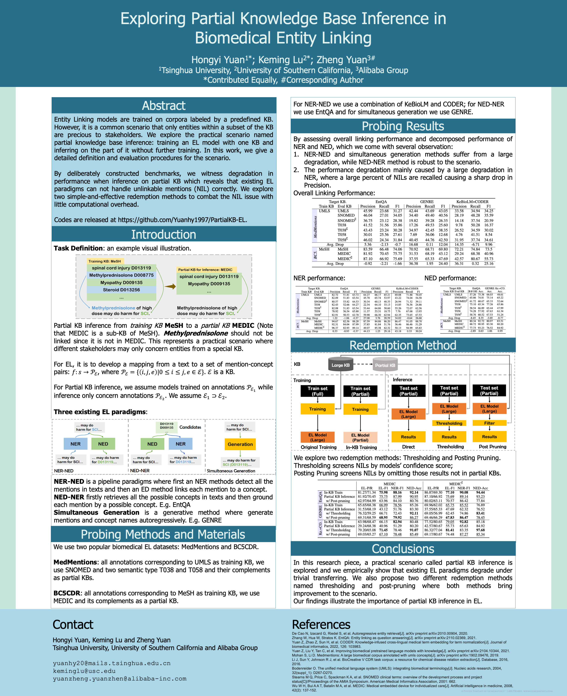

# PartialKB-EL

This is the official code repository for ACL-BioNLP 2023 paper

[*Exploring Partial Knowledge Base Inference in Biomedical Entity Linking* (ACL Anthology)](https://aclanthology.org/2023.bionlp-1.3/) or [ArXiv-version](https://arxiv.org/abs/2303.10330)

## Abstract

Biomedical entity linking (EL) consists of named entity recognition (NER) and named entity disambiguation (NED). EL models are trained on corpora labeled by a predefined KB. However, it is a common scenario that only entities within a subset of the KB are precious to stakeholders. We name this scenario partial knowledge base inference; training an EL model with one KB and inferring on the part of it without further training. In this work, we give a detailed definition and evaluation procedures for this practically valuable but significantly understudied scenario and evaluate methods from three representative EL paradigms. We construct partial KB inference benchmarks and witness a catastrophic degradation in EL performance due to dramatically precision drop.Our findings reveal these EL paradigms can not correctly handle unlinkable mentions (NIL), so they are not robust to partial KB inference. We also propose two simple-and-effective redemption methods to combat the NIL issue with little computational overhead.

## Poster @ ACL2023 for paper overview

<center>
    <a target="_blank"></a>
    <br>
    <div style="color:orange; border-bottom: 1px solid #d9d9d9;
    display: inline-block;
    color: #999;
    padding: 2px;">Paper Overview.</div>
</center>

# Citation

If you find our work useful, please cite:
```
@inproceedings{yuan-etal-2023-exploring,
    title = "Exploring Partial Knowledge Base Inference in Biomedical Entity Linking",
    author = "Yuan, Hongyi  and
      Lu, Keming  and
      Yuan, Zheng",
    booktitle = "The 22nd Workshop on Biomedical Natural Language Processing and BioNLP Shared Tasks",
    month = jul,
    year = "2023",
    address = "Toronto, Canada",
    publisher = "Association for Computational Linguistics",
    url = "https://aclanthology.org/2023.bionlp-1.3",
    pages = "37--49",
    abstract = "Biomedical entity linking (EL) consists of named entity recognition (NER) and named entity disambiguation (NED). EL models are trained on corpora labeled by a predefined KB. However, it is a common scenario that only entities within a subset of the KB are precious to stakeholders. We name this scenario partial knowledge base inference; training an EL model with one KB and inferring on the part of it without further training. In this work, we give a detailed definition and evaluation procedures for this practically valuable but significantly understudied scenario and evaluate methods from three representative EL paradigms. We construct partial KB inference benchmarks and witness a catastrophic degradation in EL performance due to dramatically precision drop.Our findings reveal these EL paradigms can not correctly handle unlinkable mentions (NIL), so they are not robust to partial KB inference. We also propose two simple-and-effective redemption methods to combat the NIL issue with little computational overhead.",
}

```

